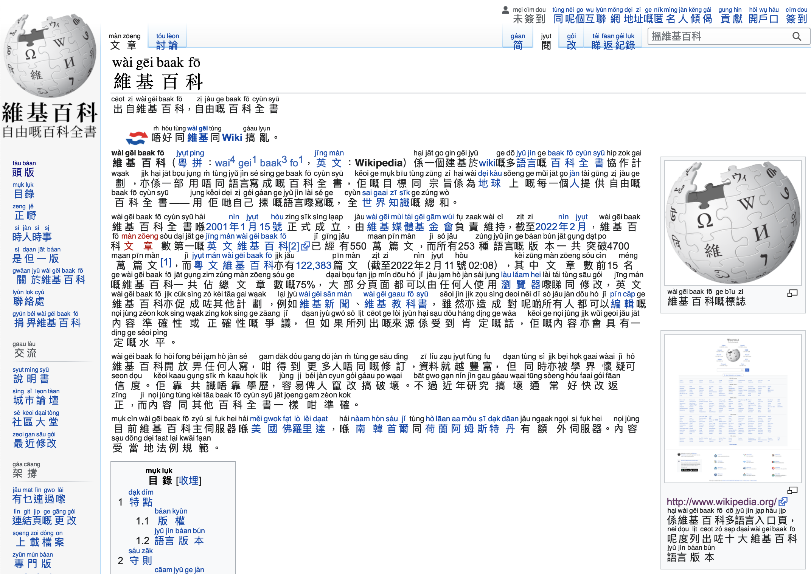

<h1>Inject Jyutping - Tone Marks Version <ruby>幫<rt>bōng</rt></ruby> <ruby>漢<rt>hon</rt></ruby> <ruby>字<rt>zị</rt></ruby> <ruby>標<rt>biu1</rt></ruby> <ruby>粵<rt>jyụt</rt></ruby> <ruby>拼<rt>ping</rt></ruby> (<ruby>拼<rt>sīng</rt></ruby> <ruby>聲<rt>dịu</rt></ruby> <ruby>符<rt>fù</rt></ruby> <ruby>號<rt>hóu</rt></ruby> <ruby>版<rt>báan</rt></ruby>) </h1>

呢個係一個可以幫網頁上面嘅漢字自動標註粵拼嘅 Chrome 同 Firefox 插件，係學習粵拼同粵語嘅強大工具。

A browser extension for Mozilla Firefox and Google Chrome that adds Cantonese pronunciation (Jyutping) on Chinese characters, a powerful tool for learning Cantonese and Jyutping. Unofficial version with tone marks:

```
1: āēīōūm̄n̄
2: áéíóúḿń
3: aeioumn
4: àèìòùm̀ǹ
5: ǎěǐǒǔm̌ň
6: ạẹịọụṃṇ
```

項目靈感來自 [EYHN/Furigana](https://github.com/EYHN/Furigana)。

This project is inspired by [EYHN/Furigana](https://github.com/EYHN/Furigana).

<h2>Install <ruby>安<rt>ōn</rt></ruby> <ruby>裝<rt>zōng</rt></ruby> </h2>

- [Chrome Web Store](https://chrome.google.com/webstore/detail/inject-jyutping/lfgpgjkjglogbndlkikjgbbfoiofbdjp)
- [Firefox Browser Add-On](https://addons.mozilla.org/en-US/firefox/addon/inject-jyutping/)

<h2>Build <ruby>編<rt>pīn</rt></ruby> <ruby>譯<rt>jịk</rt></ruby> </h2>

See [`.github/workflows/build.yml`](.github/workflows/build.yml).

<h2>Screenshot <ruby>截<rt>zịt</rt></ruby> <ruby>圖<rt>tòu</rt></ruby> </h2>


